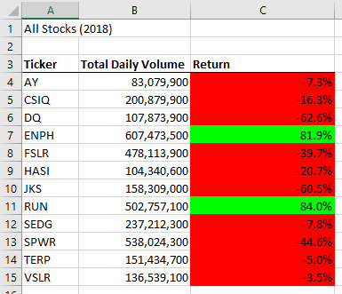
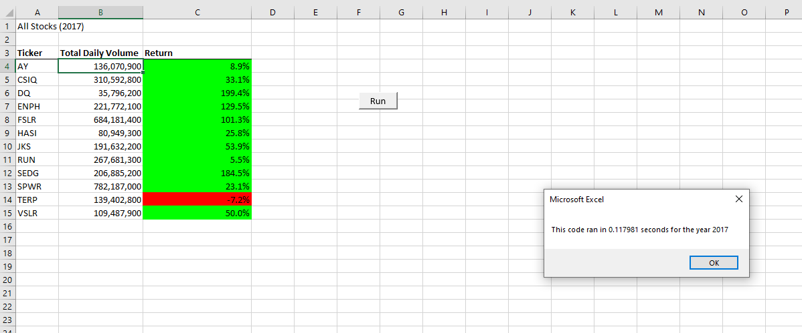

# Analysis of Stock Data Using VBA

## Overview

In this project, a number of stocks have been analyzed through VBA to find the total daily volume and yearly return for selected stocks based on data from 2017 and 2018. The code was also refactored to improve execution time.

## Results

Looking at the results from the analysis,the best performing stocks were ENPH and RUN, which returned positive returns in both 2017 and 2018. All of the stocks returned positive returns in 2017 except for TERP, but then all of the stocks except for ENPH and RUN returned negative results in 2018.

The code was also refactored from the orginal code, increasing the TickerVolumes variable by using the TickerIndex variable as the index.

Original code:

		For j = 2 To RowCount

           If Cells(j, 1).Value = ticker Then

               totalVolume = totalVolume + Cells(j, 8).Value

           End If

Refactored code:

       For j = 2 To RowCount
        
        tickerVolumes(tickerIndex) = tickerVolumes(tickerIndex) + Cells(j, 8).Value

Below are screenshots of the execution time for the original script:

And below are screenshots of the execution time for the refactored script:

## Summary

The advantage of refactoring the VBA code is that the time required to run the code and bring up the results in Excel were decreased by around a second (from 1.25 seconds to .12 seconds for the 2017 results and 1.22 seconds to .09 seconds for the 2018 results). Although all of these times are fast and the differeences would be unnoticable with the current dataset, the time savings should be significant given larger datasets and ticker information, allowing better long-term use of the code.
